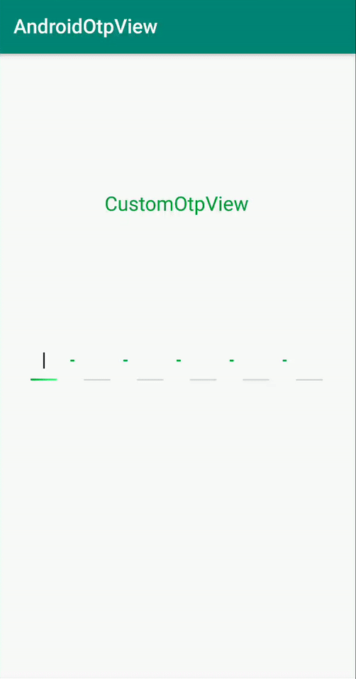
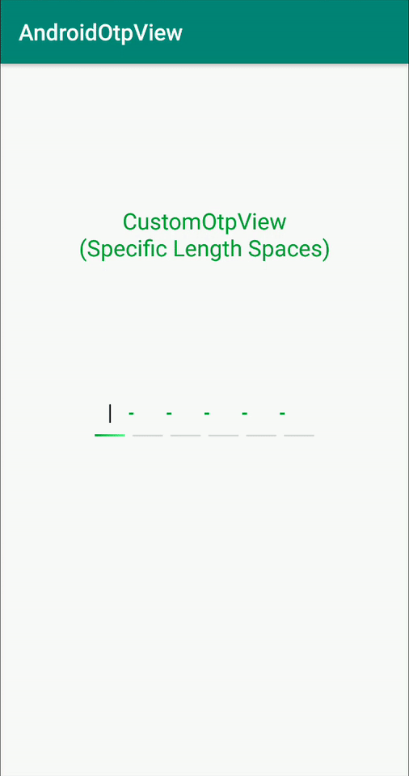

# AndroidOtpView (With gradient color in lines)
[](https://jitpack.io/#chaya222/AndroidOtpView)
[]()
[](https://android-arsenal.com/api?level=16)

## Preview
 &nbsp;&nbsp;
 &nbsp;&nbsp;
 &nbsp;&nbsp;


Otp View library for Android

## Getting started
Add it in your root build.gradle at the end of repositories:

	allprojects {
		repositories {
			...
			maven { url 'https://jitpack.io' }
		}
	}
  
Step 2. Add the dependency

	dependencies {
	        implementation 'com.github.chaya222:AndroidOtpView:0.0.2'
	}
  
## How to use the library?
Okay seems like you integrated the library in your project but **how do you use it**? Well its really easy just add the following to your xml design to show the otpview

1) With Dash between lines

```xml
.....
  <com.poonam.androidotpview2.OtpView
            android:id="@+id/otpView"
            android:layout_width="wrap_content"
            android:layout_height="wrap_content"
            custom:lineEndColor="@color/start_color_otp"
            custom:lineStartColor="@color/end_color_otp"
            custom:dashColor="@color/end_color_otp"
            custom:showDash="true"
            custom:lineCount="6" />
.....
```

2) Without Dash between lines

```xml
.....
  <com.poonam.androidotpview2.OtpView
            android:id="@+id/otpView"
            android:layout_width="wrap_content"
            android:layout_height="wrap_content"
            custom:lineEndColor="@color/start_color_otp"
            custom:lineStartColor="@color/end_color_otp"
            custom:showDash="false"
            custom:lineCount="6" />
.....
```
3) Specific length of spaces (if not provided by default space will be equal to line length)

```xml
.....
  <com.poonam.androidotpview2.OtpView
            android:id="@+id/otpView"
            android:layout_width="wrap_content"
            android:layout_height="wrap_content"
            custom:lineEndColor="@color/start_color_otp"
            custom:lineStartColor="@color/end_color_otp"
            custom:showDash="true"
	    custom:spaceLength="8"		      
            custom:lineCount="6" />
.....
```


  
## Contribution

If you are interested to contribute, feel free to send pull requests or issues.

**Note:** All your pull requests should be written in kotlin

## Questions?
Hit me on twitter [](https://twitter.com/parth_poonam)

## License

 MIT License

    Copyright (c) 2019 Poonam Parth

    Permission is hereby granted, free of charge, to any person obtaining a copy
    of this software and associated documentation files (the "Software"), to deal
    in the Software without restriction, including without limitation the rights
    to use, copy, modify, merge, publish, distribute, sublicense, and/or sell
    copies of the Software, and to permit persons to whom the Software is
    furnished to do so, subject to the following conditions:

    The above copyright notice and this permission notice shall be included in all
    copies or substantial portions of the Software.

    THE SOFTWARE IS PROVIDED "AS IS", WITHOUT WARRANTY OF ANY KIND, EXPRESS OR
    IMPLIED, INCLUDING BUT NOT LIMITED TO THE WARRANTIES OF MERCHANTABILITY,
    FITNESS FOR A PARTICULAR PURPOSE AND NONINFRINGEMENT. IN NO EVENT SHALL THE
    AUTHORS OR COPYRIGHT HOLDERS BE LIABLE FOR ANY CLAIM, DAMAGES OR OTHER
    LIABILITY, WHETHER IN AN ACTION OF CONTRACT, TORT OR OTHERWISE, ARISING FROM,
    OUT OF OR IN CONNECTION WITH THE SOFTWARE OR THE USE OR OTHER DEALINGS IN THE
    SOFTWARE.
