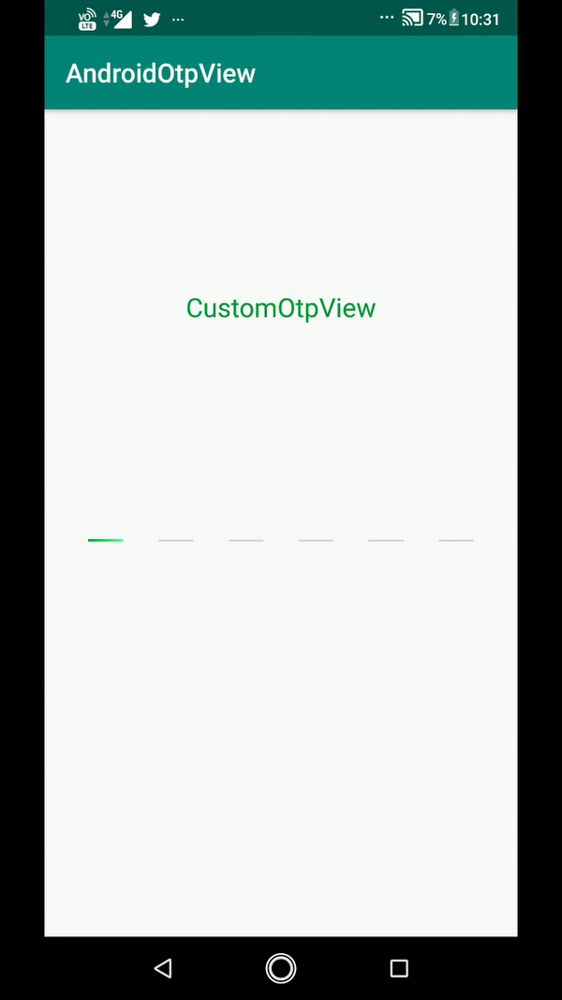

# AndroidOtpView

## Preview

Otp View library for Android

## Getting started
Add it in your root build.gradle at the end of repositories:

	allprojects {
		repositories {
			...
			maven { url 'https://jitpack.io' }
		}
	}
  
Step 2. Add the dependency

	dependencies {
	        implementation 'com.github.chaya222:AndroidOtpView:0.0.2'
	}
  
